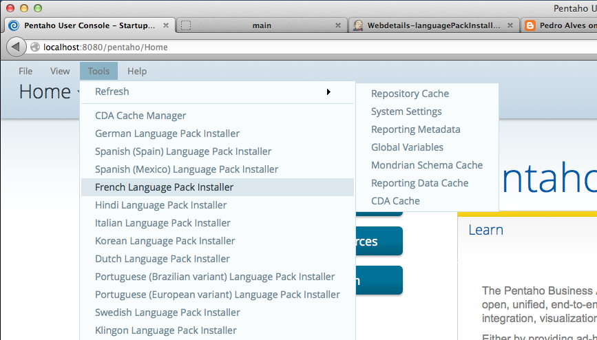
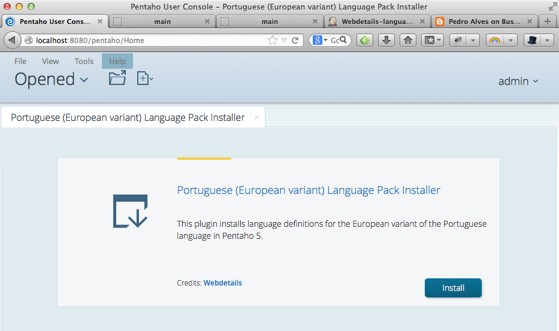
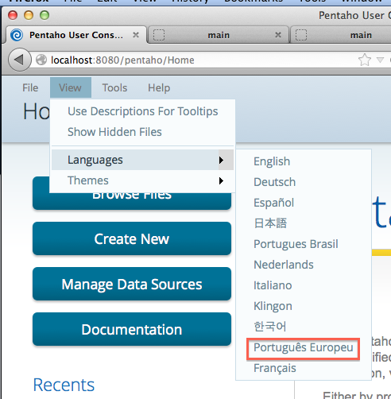

Language Pack Installer
====================

Pentaho Language Pack Installer: a plugin for installing language packs

# Getting started

## Step 1: install CDF and CDE

The Language Pack Installers require Pentaho 5+, and depend on the following CTools: 

* Community Dashboard Framework (CDF)
* Community Dashboard Editor (CDE) 

If you are using the Community Edition, you can install these packages directly from the Marketplace.

If you are using the Enterprise Edition, you can manually downloading them from [Pentaho's Continuous Integration server](http://ci.pentaho.com) and unzipping the .zip file to your `pentaho-solutions/system` folder.
Just follow the instructions on [Pedro's blog](http://pedroalves-bi.blogspot.pt/2013/11/ctools-for-pentaho-50-is-available-cdf.html).

## Step 2: download a language-specific pack
Once we conclude the integration of the language packs with the Marketplace, all you'll need to do is visit the Marketplace, but for now you need to follow these instructions:

Each language pack is a actually zipped Pentaho plugin built using CPK and Sparkl. You'll find the latest version if the language packs at [Analytical Lab's Continuous Integration server](http://ci.analytical-labs.com/job/Webdetails-languagePackInstallers/), under the project `Webdetails-languagePackInstallers`.

Currently you can choose from about 12 zip files, each corresponding to a single language. 
Just download the zip file of any language you want and extract it to your `pentaho-solutions/system` folder.
Congratulations, you've just added the language pack installer to your system!

## Step 3: restart your server
Please restart your server to force Pentaho to load the recently installed plugin(s).

## Step 4: run the installer
If you login as "admin", you should see a new entry in the Tools menu, just like the following screenshot:

Just click on the corresponding entry to launch the installer. This effectively opens a new tab using an url like `http://localhost:8080/pentaho/plugin/languagePack_pt_PT/api/main`:

Pressing the "Install" button will massively copy the files to the appropriate places.

## Step 5: test 

If you refresh the Pentaho User Console after installing a language pack, you will also see that a new entry was added to the View > Languages menu:

Another ways to select a different locale is to specify the `locale` parameter, as in:

* `http://localhost:8080/pentaho/Home?locale=fr`
* `http://localhost:8080/pentaho/Home?locale=ko`
* `http://localhost:8080/pentaho/Home?locale=pt_BR`
* etc