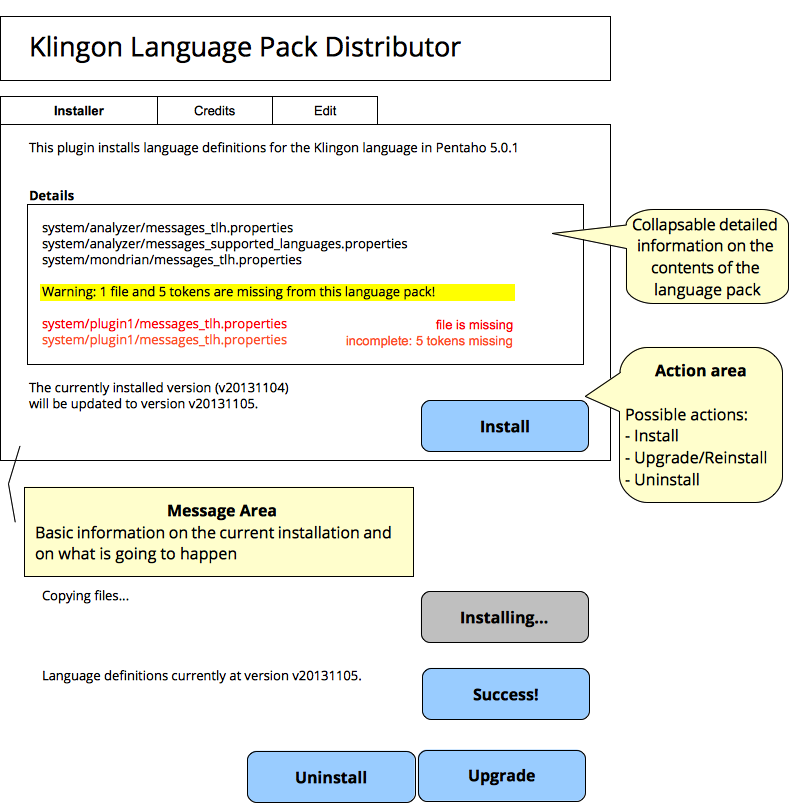
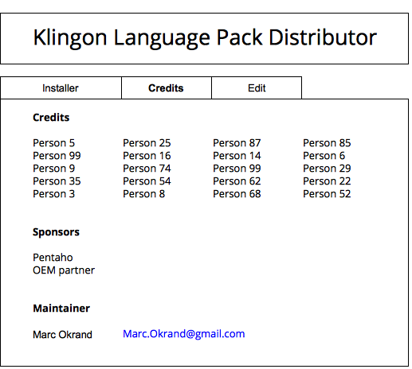
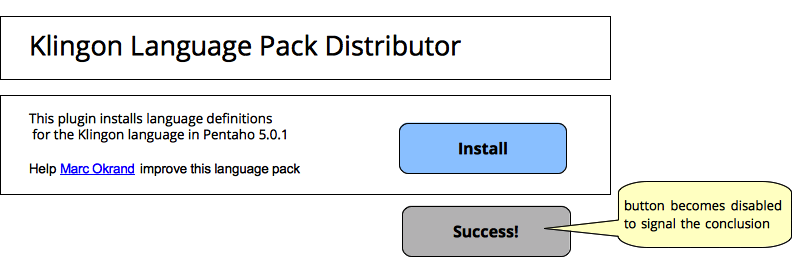
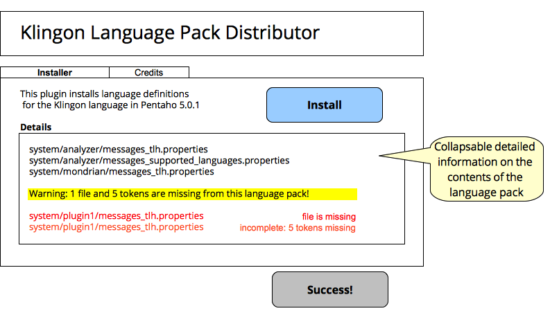
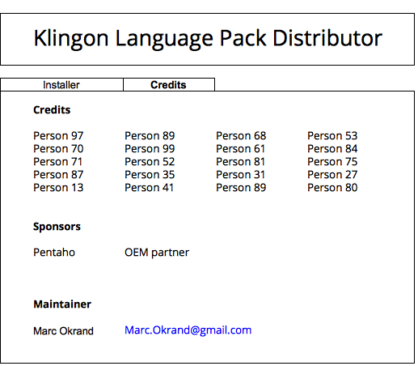

Language Pack Installer
=============

This application simplifies the process of deploying language packs.
Once installed from the marketplace, this application provides a means for patching a Pentaho installation with a set of messages translated to some language (Klingon in this example.)

## Global, long-term vision

This section list and describes the application main visual "landing points":
the application dashboards.

### Main Dashboard

This dashboard allows the user to manage the language pack: install and remove the package. 
It should also optionally shows the contents of the pack. 

#### Endpoints

* installpack
* removepack
* listpackfiles
* getpackmetadata
* getsystemmetadata

### Credits Dashboard

Give credit to the hard work of the translators and to the institutions that sponsored the work.

#### Endpoints

* listcredits (type = {people, sponsors})
  * name, urlSite, urlIcon, contact, description
* getpackmetadata

### Edit Dashboard
Provide an interface for editing language packs

#### Endpoints
* listfile
* loadfile
* savefile

Endpoints
---------

This section describes the End Points (Kettle) in the application. These
endpoints were mentioned in the previous section, in connection to the
application dashboards. Here, we have a detailed description of each one of
them, including their logic, input parameters and output types.
  
* installpack
 	* Description:	copy a whole tree of files to destination, set cookie in system with version number
	* Parameters: (none)
	* Output: (none)
* removepack
	* Description:	delete files at destination, remove cookie in system with version number
	* Parameters: (none)
	* Output: (none)
* listpackfiles
 	* Description: list files in the pack, compare with the system
	* Parameters: mode=install,remove
	* Output: file, operation (add, remove, edit), 
* getpackmetadata
 	* Description: retrieve information on the language pack. Suggested implementation: read from a metadata.xml file
	* Parameters: (none)
	* Output: version, maintainerName, maintainerContact, language
* getsystemmetadata
	* Description:	
	* Parameters: 
  	* Output: version
* listcredits 
	* Description: retrieve information on the contributors for this language pack. Suggested implementation: read from a credits.xml file
	* Parameters: type = {people, sponsors}
  	* Output: name, urlSite, urlIcon, contact, description
* loadfile
  	* Description:	load a text file for editing
	* Parameters: filename
	* Output: (none)
* savefile
 	* Description:	copy files to destination, set cookie in system with version number
	* Parameters: filename
	* Output: (none)

# Version 1: Dashboards
Quickly deploy an application that assists users, translators and the community to install a language pack in Pentaho.
Effectively, this application provides a means for distributing the effort on translating the Pentaho platform into the 100+ languages in the world.

Use cases:

* translators can manually edit the files contained in this application without needing to know where the files are supposed to be installed
* users can finally have Pentaho in their favourite languages

## Main dashboard

### Goal

Provide minimum functionality for the application: install the language pack files.
The users should also be able to contact the maintainer/translator for glitches and suggestions.

### Actions

The user can only click on the "Install" button (or not).
Once installed, the button is disabled.
If the user desires to reinstall the language pack, he/she needs to manually reload the page: the "Install" button becomes available again.

### Endpoints
* installpack
 	* Description:	copy two tree of files to the `pentaho-solution` and pentaho server folders, e.g. `cp -R ${plugin}/data/solution ${plugin}/../; cp -R ${plugin}/data/server ${server}/`
	* Parameters: (none)
	* Output: (none)

## Credits dashboard
Not to be implemented in this version

## Edit dashboard
Not to be implemented in this version

# Version 2

## Main dashboard

### Goal

Provide minimum functionality for the application: install the language pack files.

### Actions

The user can only click on the "Install" button (or not).
Once installed, the button is disabled.
If the user desires to reinstall the language pack, he/she needs to manually reload the page: the "Install" button becomes available again.

### Endpoints
* installpack (unchanged from version 1)

## Credits dashboard
### Goal

Display information on the contributors to the language pack.

### Actions

### Endpoints
* listcredits (as described above in *Global Vision*)
* getpackmetadata (as described above in *Global Vision*)
	
## Edit dashboard
Not to be implemented in this version

